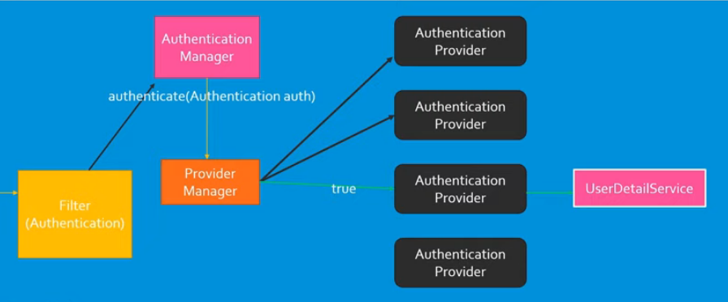

# Spring Boot Security

Spring Security is a powerful and highly customizable authentication and access-control framework.
Spring Security is a framework that focuses on providing both authentication and authorization to Java applications.

Before starting Security in more details lets understand few basic terms

1) Authentication : Validating user with different ways like username password.
2) Authorization : Giving permission to user to access a specific resource or function

## How Spring Security Works : 

1) First filter comes in action which will intercept request it will not do much work it will just create authentication object and delegate request to Authentication Manager
   1) e.g. BasicAuthenticationFilter which internally extends OncePerRequestFilter
2) Authentication Manager : 
   1) Its manager responsibility to authenticate user by using authentication object.
   2) It internally invoke authenticate(Authentication auth) method to authenticate the user 
   3) But this manager is interface only it doesn't have intelligence to authenticate the user.
3) Authentication Provider :
   1) There are different authentication provider but Authentication manager don't have intelligence to identify which provider need to invoke.
   2) Manager call to authentication provider and that identifies which provider need to call further to authenticate user. 

## Spring Security Dependency : 
### Basic Authentication : 

        <dependency>
            <groupId>org.springframework.boot</groupId>
            <artifactId>spring-boot-starter-security</artifactId>
        </dependency>

   Just adding this security component it will enable Basic authentication where user need to provide below credentials. 
   
    Username :  user
    Password : <generated at starting of application>

Further we can modify default behaviour by implementation security configuration class which will further extend WebSecurityConfigurerAdapter class

#### Case 1: Basic Authentication with Username : user and password: Generated at runtime.

        http.authorizeRequests()
        .anyRequest()
        .authenticated()
        .and()
        .httpBasic();

#### Case 2: Basic Authentication with in memory username password
For this we need to follow below steps
1) configure(AuthenticationManagerBuilder auth) method
2) Set inMemoryAuthentication username , password and role mandatory

        protected void configure(AuthenticationManagerBuilder auth) throws Exception {
            auth.inMemoryAuthentication().withUser("mukesh").password(this.passwordEncoder().encode("password")).roles("NORMAL")
            .and().withUser("admin").password(this.passwordEncoder().encode("admin_password")).roles("ADMIN");
        }

3) Decide if you need encoding or not. For this need to define @Bean PasswordEncoder

    public PasswordEncoder passwordEncoder(){
            return new BCryptPasswordEncoder(10);
    }

#### Case 3: Basic Authentication with roles authentication for separate endpoint Here Particular endpoint will be accessible to particular role only

Here user will be able to access endpoint  depends on Role assigned to user 

        http.authorizeRequests()
        .antMatchers("/public/**").hasRole("NORMAL")
        .antMatchers("/users/**").hasRole("ADMIN")
        .anyRequest()
        .authenticated()
        .and()
        .httpBasic();

#### Case 4 : CSRF (Cross Site Request Forgery)
Cross-Site Request Forgery (CSRF) is an attack that forces authenticated users to submit a request to a Web application against which they are currently authenticated. CSRF attacks exploit the trust a Web application has in an authenticated user.
Here is reference how to prevent CSRF attack.
https://www.veracode.com/blog/secure-development/preventing-csrf-attacks 

*** Once u add spring security in your application user will not able to call POST , PUT , PATCH method without disabling CSRF. 

Other way to this is Pass proper header X-XSRF-TOKEN which is received from GET call to post or PUT method or define the proper origin for this

#### Case 5 : CSRF (Cross Site Request Forgery) using CookieCsrfTokenRepository
This case token will be get added to cookie and will be available in response Header.
Then u can use that X-XSRF-TOKEN further. But generally we disable csrf for non browser client

      http.csrf().csrfTokenRepository(CookieCsrfTokenRepository.withHttpOnlyFalse())
      .and()
      .authorizeRequests()
      .antMatchers("/public/**").hasRole("NORMAL")
      .antMatchers("/users/**").hasRole("ADMIN")
      .anyRequest()
      .authenticated()
      .and()
      .httpBasic();

#### Case 6 : Using Database to store username and password
Steps to follow 
1) Create table with username , password ,roles details.  You can use JPA Repository and enable ddl-auto to create table automatically.
2) We need to override two classes
   1) CustomUserDetails   which will implement  org.springframework.security.core.userdetails.UserDetails and override all methods 
   2) CustomUserDetailsService which will implement org.springframework.security.core.userdetails.UserDetailsService

Sample Implementation : 
      https://www.javadevjournal.com/spring/spring-security-userdetailsservice/#:~:text=The%20UserDetailsService%20is%20a%20core,to%20the%20Spring%20security%20API. 